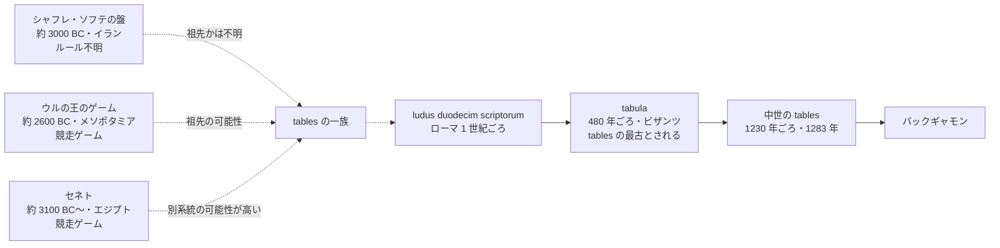

# TODO-024 調査報告（「歴史は古い」の 3 枚の絵と、起源の話）

調べた日: 2026-09-30。コードは直していない。画像は自分で開いて見た。
作業用にダウンロードした画像は scratchpad にあり、リポジトリには追加していない。

確認の程度の記号:

- 画像照合: `images/bg-*.png` と Wikimedia Commons の画像を並べて見て、同じ絵と確かめた
- 取得: ページを取得して本文を確認した（Wikipedia などは要約を通した取得）
- 検索のみ: 検索結果の要約だけ
- 未確認: 確かめられなかった

## 結論（先に）

| 画像 | 依頼文の見立て | 実際 |
|------|----------------|------|
| `bg-egypt.png` | ネフェルタリがセネトを打つ絵 | **その通り**（画像照合）。ただしセネトはバックギャモンの仲間（tables）ではなく、別種の双六の一種 |
| `bg-medieval.png` | アルフォンソ 10 世『遊戯の書』（1283） | **違う**（画像照合）。『カルミナ・ブラーナ』（Codex Buranus、13 世紀前半）の tables（バックギャモンの前身）の場面 |
| `bg-nara.png` | 何時代の何という作品か | **特定できなかった（未確認）**。絵柄は奈良時代のものではなく、江戸時代初め（17 世紀）の風俗画に見える。`bg-edo.png` の彦根屏風とは別の絵 |

スライドの時間軸に関わる指摘:

- 3 枚は「エジプト（紀元前 13 世紀ごろ）→ 中世ヨーロッパ（13 世紀）→ 日本（飛鳥時代）」の順に並ぶ。
  日本への伝来（7 世紀）は中世ヨーロッパの絵（13 世紀）より前なので、左から右へ時代が進む矢印とは合わない。
  さらに右の絵そのものが 17 世紀ごろに見えるので、「飛鳥時代」の絵として出すのは誤解のもと
- ファイル名の `nara` は、絵の時代でなく撮影元の動画での位置づけから付けた名前の可能性がある（推測。TODO-003 は動画のフレームから切り出した）

## 1. 3 枚の絵

### 1-1. `bg-egypt.png` — ネフェルタリ王妃がセネトを遊ぶ壁画

- 何: 古代エジプト第 19 王朝、ラムセス 2 世の王妃ネフェルタリの墓（QV66、王妃の谷）の壁画。王妃が盤（セネト）で駒を進める場面
- いつ・どこ: 紀元前 13 世紀ごろ（Commons の日付欄は「紀元前 1298〜1235 年ごろ」「紀元前 1279〜1213 年ごろ、第 19 王朝、ラムセス 2 世の治世」。Wikipedia「Senet」は「紀元前 1295〜1255 年」）。エジプト、テーベ西岸
- 何の遊び: セネト（Senet）。30 マスの盤で駒を進めて先に盤から出す競走ゲーム
- 確認: 画像照合（下の Commons `Nefertari juega al Senet, tumba de Nefertari.jpg` と構図が一致。`bg-egypt.png` はその一部の切り出し）
- 出典
  - https://commons.wikimedia.org/wiki/File:Nefertari_juega_al_Senet,_tumba_de_Nefertari.jpg （CC BY-SA 4.0）
  - https://commons.wikimedia.org/wiki/File:Queen_Nefertari_Playing_Senet_MET_DT11770.jpg （メトロポリタン美術館の模写、Nina M. Davies 作、CC0。「circa 1279–1213 B.C.、Dynasty 19、reign of Ramesses II」）
  - https://en.wikipedia.org/wiki/Senet

### 1-2. `bg-medieval.png` — 『カルミナ・ブラーナ』の tables の場面

- 何: 中世の写本 Codex Buranus（『カルミナ・ブラーナ』、Bayerische Staatsbibliothek, Clm 4660）の、tables（Wurfzabel、バックギャモンの前身）を遊ぶ挿絵。2 人が盤を挟んで座り、右に杯を掲げる人が立つ。下の行はラテン語
- いつ・どこ: 1230 年ごろ（Wikipedia「Carmina Burana」）。中央ヨーロッパのバイエルン方言圏。成立地は Seckau（シュタイアーマルク）か Neustift（南チロル）かで諸説あり、のちに Benediktbeuern の修道院に伝わった（ここは Wikipedia の要約経由）
- 何の遊び: tables 系の遊び。盤の三角形（ポイント）と駒の並びがバックギャモンと同じ形
- 『遊戯の書』ではない理由: アルフォンソ 10 世の写本の tables の絵は、青地に 2 人が座り、盤が縦向きに 1 枚立つ構図（Commons の `Alfonso-todas-tablas.jpg` と見比べて確認）。この絵は赤枠の盤を 2 人が挟み、右に杯を持つ人が立ち、下の行はラテン語に見える（アルフォンソの本文はカスティーリャ語のはずだが、こちらは未確認）
- 確認: 画像照合（Commons `Wurfzabel.jpg` と一致）。フォリオ番号は Commons のファイル名が「folio 91」まで。91r か 91v かは**未確認**
- 出典
  - https://commons.wikimedia.org/wiki/File:Wurfzabel.jpg （パブリックドメイン。説明: 「Wurfzabel, Tabula game … 13. Jh., Codex Buranus」）
  - https://commons.wikimedia.org/wiki/File:Codex_Buranus-91-giocatori.jpg （同じ写本の folio 91 の別の切り出し）
  - https://en.wikipedia.org/wiki/Carmina_Burana （ゲームの挿絵が 3 つ: サイコロ・tables・チェス、写本の年代 1230 年）

### 1-3. `bg-nara.png` — 特定できなかった（未確認）

- 見えるもの: 盤を挟んで向かい合う 2 人。左は花柄の着物と結い上げた髪、右は家紋入りの袖。盤は木の箱形で、駒が並ぶ。絵柄と着物の柄は、江戸時代初めの風俗画（寛永〜寛文ごろ）に近い
- 試したこと（全部だめ）
  - Commons の彦根屏風の切り出し（`Hikone Sugoroku.jpg`、`Hikone Sugoroku ganz.jpg`）: 別の絵。**こちらは `bg-edo.png`**（→ TODO-027 の報告）
  - 松浦屏風（大和文華館、`Iwasa Matabei 001/002.jpg`）: 別の絵（盤の遊びの場面は碁盤らしいものだけ）
  - 大英博物館の遊里図（`Painting (BM 1914,0512,0.9).jpg`、盤双六の場面あり）: 別の絵
  - Commons の `3 Brettspiele.jpg`（将棋・碁・盤双六、鳥居清長 1780 年ごろとされる）: 別の絵
  - 「盤双六 屏風」などの日本語・英語の検索: 該当する作品名は出なかった
- 元の動画（関内バックギャモンの会・谷林 陽一）に画像の出所が出ているはずなので、利用者に聞くのが早い（推測）
- 判断してよいこと: **少なくとも「飛鳥時代」の絵ではない**（絵柄は 17 世紀ごろ。画像を見て言えること）

## 2. 起源として挙げられる古い証拠と、祖先といえるかの見方

前提: バックギャモンは tables（盤の両側に 12 ポイントずつ、サイコロを振って駒を進める遊びの一族）の一つ。
一般的な見方では「tables の確実な最古」は古代ローマの tabula（後述）で、それ以前は**祖先かもしれない競走ゲーム**という扱い。

| 証拠 | 年代・場所 | 中身 | 祖先といえるか（一般的な見方） | 出典 |
|------|-----------|------|------------------------------|------|
| シャフレ・ソフテ（燃えた都市）の盤 | 紀元前 3000 年ごろ、イラン南東部 | 黒檀の盤（蛇が 20 マスを巻く）、駒 60 個、サイコロ。ルールは不明 | **不明**。「最古のバックギャモン」と報じられたが、確かなのは「約 5000 年前の盤とサイコロがある」まで。tables だと示す証拠は無い | https://en.wikipedia.org/wiki/Tables_game 、http://www.kavehfarrokh.com/news/burnt-city-worlds-oldest-backgammon-game/ （報道） |
| ウルの王のゲーム | 紀元前 2600 年ごろ、メソポタミア | 20 マスの盤。粘土板にルールが残る（紀元前 177 年ごろのバビロニアの粘土板） | 競走ゲーム。Wikipedia「Backgammon」は「祖先または中間段階かもしれない」（may also be an ancestor or intermediate）と慎重。「Tables game」は「tables の一族の祖先」とやや強く書く | https://en.wikipedia.org/wiki/Backgammon 、https://en.wikipedia.org/wiki/Tables_game |
| セネト | 紀元前 3100 年ごろの板の破片、絵は紀元前 2500 年ごろから、エジプト | 30 マスの競走ゲーム | Wikipedia「Senet」にバックギャモンとの関係の記述は無い。**バックギャモンの祖先とは言いにくい**（別の競走ゲーム） | https://en.wikipedia.org/wiki/Senet |
| ludus duodecim scriptorum（12 の線の遊び） | ローマ。オウィディウスの著作（紀元 8 年ごろ）に出る。アフロディシアスに 2 世紀の盤 | 12 マスの列が 3 段、サイコロ 3 個 | tabula の直接の前身とされる。**祖先といえる** | https://en.wikipedia.org/wiki/Tables_game 、https://commons.wikimedia.org/wiki/File:Roman_Game_of_12_Lines_Board_-_Aphrodisias.jpg |
| tabula | 東ローマ皇帝ゼノンの詩（480 年ごろ）が最古の記述 | 24 ポイント、駒 15 個、サイコロ 2 個の記述 | **tables として確かめられる最古**。バックギャモンの直接の祖先と見てよい | https://en.wikipedia.org/wiki/Tables_game |
| nard（ペルシャ） | 3〜6 世紀のあいだに現れた | 東方の tables | tabula と並ぶ、または同じ系統の親戚。どちらが先かは Wikipedia も断定していない | https://en.wikipedia.org/wiki/Backgammon |
| アルフォンソ 10 世『遊戯の書』 | 1283 年、スペイン | サイコロと tables のルール集 | 中世の tables の資料（祖先というより近い時代の記録） | https://en.wikipedia.org/wiki/Backgammon |

スライドの今の記述への意見（事実の面だけ）:

- 「起源は約 5,000 年前（中東）」: 5,000 年前（紀元前 3000 年）の盤はイランで見つかっているのは事実。ただし「バックギャモンの起源」とまでは言い切れない（tables と確かめられる最古は紀元前後のローマと 480 年ごろ）。
  言い換え案: 「約 5,000 年前の遺跡から、似た遊びの道具が見つかっている」
- 「世界中に拡散・定着」: ローマ→ビザンツ・ペルシャ→中世ヨーロッパ、と広がった記録はある（上の表）。事実として問題は無い
- 「日本には飛鳥時代」: 日本書紀の持統天皇 3 年（689）12 月に「双六を禁断す」とあり、日本で「双六」が文献に現れる最古。7 世紀には既に広まっていた。ただし日本の盤双六が tables と同じ遊びかは「似ている」が通説で、遊び方の細部は資料次第（Wikipedia「盤双六」は 7 世紀までに中国経由で伝来と書く）。正倉院に「木画紫檀双六局」など双六の盤がある（奈良時代、756 年に光明皇后が献納）。
  出典: https://ja.wikipedia.org/wiki/盤双六 、https://www.narahaku.go.jp/collection/500-0.html （模造品の紹介ページ。文言は検索結果の要約で確認）。「飛鳥時代に伝わった」と断定する史料は見つからなかった（未確認。「飛鳥時代には既にあった」までは言える）

## 3. Wikimedia Commons の候補（ダウンロードはしていない。ライセンスは Commons のページ情報による）

起源の話に合うもの。依頼の条件（CC0/PD/CC BY）に合うものに印を付けた。

| 用途 | ファイル | ライセンス | 印 |
|------|---------|-----------|----|
| ウルの王のゲーム（大英博物館） | https://commons.wikimedia.org/wiki/File:British_Museum_Royal_Game_of_Ur.jpg | CC0 | 使える |
| ネフェルタリ（メトロポリタン美術館の模写） | https://commons.wikimedia.org/wiki/File:Queen_Nefertari_Playing_Senet_MET_DT11770.jpg | CC0 | 使える（今の `bg-egypt.png` と同じ場面。元の壁画そのものではなく模写） |
| ローマの盤（アフロディシアス、2 世紀） | https://commons.wikimedia.org/wiki/File:Roman_Game_of_12_Lines_Board_-_Aphrodisias.jpg | CC BY 2.0 | 使える（要クレジット）。切り出し版 `...-trimmed.jpg` は CC BY-SA 3.0 なので不可 |
| 中世の tables（今の絵の元） | https://commons.wikimedia.org/wiki/File:Wurfzabel.jpg | PD | 使える |
| 中世の tables（マネッセ写本、1305〜15 年ごろ） | https://commons.wikimedia.org/wiki/File:Puffspieler.jpg | PD | 使える。「Herr Goeli」の 2 人がバックギャモンを打つ。構図が大きく、スライド向き |
| 中世の tables（アルフォンソ 10 世、1283 年） | https://commons.wikimedia.org/wiki/File:Alfonso-todas-tablas.jpg | 未確認（写本は PD だが、このファイルのライセンス欄は確認していない） | 要確認 |
| シャフレ・ソフテの盤 | https://commons.wikimedia.org/wiki/File:Shahr-i-sokhta-board-game.jpg 、https://commons.wikimedia.org/wiki/File:The_scholarly_reconstruction_of_the_Shahr-i_Sokhta_board_game.jpg | どちらも CC BY-SA 4.0 | **条件外**（CC BY-SA）。Commons で他の写真は見つからなかった |
| tabula の盤の図（ゼノンの遊び） | https://commons.wikimedia.org/wiki/File:Tabula_-_boardgame_-_Zeno_game.svg | CC BY-SA 3.0 | 条件外 |
| ローマの床の盤 | https://commons.wikimedia.org/wiki/File:Roman_Board_Game_01.jpg | CC BY-SA 2.0 | 条件外 |

日本の絵の候補（`bg-nara.png` の代わりになりうるもの）:

- 彦根屏風（寛永年間 1624〜44 年ごろ、彦根城博物館蔵、国宝）: https://commons.wikimedia.org/wiki/File:Hikone_Sugoroku.jpg （PD）。ただし今は `bg-edo.png` として「不遇の歴史」で使っている
- 正倉院の双六局の写真: 宮内庁の正倉院宝物のページ（https://shosoin.kunaicho.go.jp/treasures/?id=0000012217&index=14 は読み込み中の表示で本文を取れなかった）。画像の利用条件は**未確認**

## 4. 決めることの材料（main 向け）

- 3 枚の並びを時代順にするなら: エジプト（紀元前 13 世紀）→ 日本（7〜8 世紀）→ 中世ヨーロッパ（13 世紀）。ただし日本の絵は今の `bg-nara.png` が使えない（出所が不明で、時代も合わない）
- 日本の絵を差し替えるなら、正倉院の双六局（奈良時代の実物）が時代に合う。画像の利用条件の確認が要る
- `bg-medieval.png` の説明は「アルフォンソ 10 世」でなく「『カルミナ・ブラーナ』（13 世紀）」と書く
