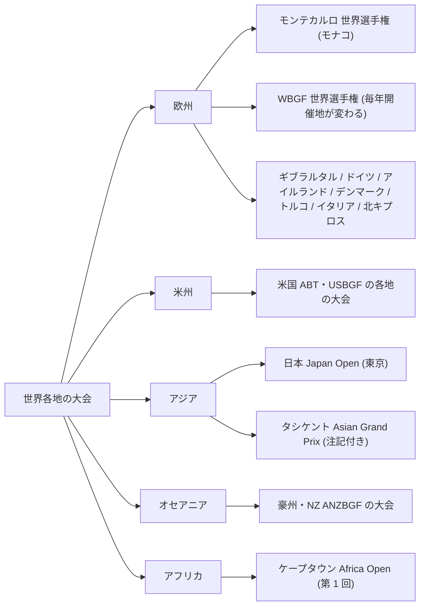

# TODO-046 調査報告: 世界各地で国際大会が開かれている裏付け

調査日: 2026-09-30。対象: `slides/backgammon.js` の「世界中でプレーされている」。
目的: 「世界各地で国際大会が開かれている」ことを、出典の取れた大会名・開催地だけで裏付ける。
リポジトリの他のファイルは変えていない（このファイルだけ新規）。

## 1. 結論

- **モンテカルロの世界選手権は、出典が 6 つ取れた。** 1979 年からモナコで開催、直近は 2026 年（7/25〜8/2）。
  ただし **2020 年は開催されていない**（Wikipedia と GammonLife の 2 件）。「1979 年から毎年」は 2020 年を除く。
- **開催地が毎年変わる WBGF 世界選手権が使いやすい。** 団体・個人の世界選手権は 2014〜2026 年の 13 回が、
  13 か所の別々の都市（2025 ギリシャ、2026 ロンドン）。WBGF 公式に一覧がある。
- **各国で回数を重ねている大会**（第 何 回、の表記が出典にある）: アイルランド（第 34 回）、トルコ（第 20 回・第 41 回）、
  イタリア（第 21 回）、北キプロス（第 13 回）、日本（第 54 回）、米国（第 51 回・第 23 回など）。
  ただしほとんどが**出典 1〜2 つ（主催者の自サイトか WBGF のカレンダー）**。
- **まとめて言える数字は 4 種類取れた**（§4）。「WBGF の加盟は 40 か国以上・6 大陸」が最も固い（WBGF 公式と Wikipedia の 2 件）。
- **European Backgammon Tour（同名の現行ツアー）と、Istanbul Open の過去の開催年は確認できなかった。**
- **使うなら注記が要る大会:** Asian Grand Prix（タシケント）。60 か国以上と派手だが、主催の IBF は WBGF と別の組織で、
  種目が short/long backgammon（ナルディ系）。標準のバックギャモンと同じルールとは限らない。

## 2. 大会の表

「出典の数」は**別々の組織**の数。同じ団体の複数ページは 1 と数え、注に書いた。
「直近」は 2026-09-30 時点。それ以降の日付は「予定」（未開催）。
引用は原文のまま短く抜いた。

### 2-1. 世界選手権

| 名前 | 開催地 | 定期開催か（直近） | 出典 URL | 出典の数 | 原文の引用 |
|---|---|---|---|---|---|
| World Backgammon Championship（BGWC） | Fairmont Monte Carlo、モンテカルロ、モナコ | 1979 年から。**直近 2026-07-25〜08-02 開催済み**（優勝 Petko Kostadinov）。**2020 年は開催なし** | 公式 https://www.backgammonworldchampionship.com/ ／ https://en.wikipedia.org/wiki/World_Backgammon_Championship ／ https://monacolife.net/55th-backgammon-world-championship-returns-to-monaco/ ／ https://gammonlife.com/world-championships-monte-carlo-1979-to-2024/ ／ https://thegammonpress.com/world-backgammon-championship-1967-to-1979-results-and-some-historical-notes/ ／ https://www.wbfturkey.com/ | 6（公式サイトは開催日と優勝者のみで、1979 年とモナコの記載は取れず。1979 年の起点は Wikipedia・Monaco Life・Gammon Press の 3 件） | 公式: "BGWC: Jul 27th - Aug 2nd / Monte Carlo Open: Jul 25th - 26th"、"Petko Kostadinov (USA/Bulgaria)"。Wikipedia: "Since 1979, the championship has been held in Fairmont Monte Carlo Monte Carlo, Monaco"。Monaco Life（2024-07-17）: "having visited the Mediterranean micronation every summer since 1979"、"55th edition"。GammonLife: "2020 no championship was held"。Gammon Press: "the decision was therefore made to combine the Bahamas and Monte Carlo tournaments into one World Championship, to be held in Monte Carlo in July" |
| WBGF World Team / Women's Team / Individual Championships | 開催地は毎年変わる。2026 は **ロンドン**（Mercure Hotel Earl's Court）、2025 は Kamena Vourla（ギリシャ） | 毎年。**直近 2026-08-24〜30 開催済み** | 公式 https://wbgf.info/about ／ https://wbgf.info/ ／ 主催 UKBGF https://ukbgf.com/wtc2026 ／ https://www.wbfturkey.com/ | 3（WBGF 公式・UKBGF・WBF-Türkiye。WBGF の about と home は 1 と数えた） | WBGF about の一覧: "2025 Kamena Vourla, Greece / 2024 Stockholm, Sweden / 2023 Skopje, North Macedonia / 2022 Venice, Italy / 2021 Trier, Germany / 2020 Forges-les-Eaux, France / 2019 Budva, Montenegro / 2018 Catalan Bay, Gibraltar / 2017 Reykjavik, Iceland …"。UKBGF: "We have 28 national teams and 16 women's teams"。WBF-Türkiye（2026-09-04）: "45 ülkeden … 551 oyuncunun"（45 か国・551 人）、"28 milli takım" |

### 2-2. 欧州

| 名前 | 開催地 | 定期開催か（直近） | 出典 URL | 出典の数 | 原文の引用 |
|---|---|---|---|---|---|
| Gibraltar Backgammon Championship | ギブラルタル（Sunborn Hotel） | 第 8 回が 2025-01-29〜02-02。**第 9 回は 2026-01-28〜02-01 の予定と 2025 年の記事にあるだけで、2026 年に開かれたかは未確認** | https://www.chronicle.gi/?p=152537 ／ https://www.yourgibraltartv.com/society/30593-8th-gibraltar-backgammon-championship | 2（後者は検索結果の要約のみで本文は 404。日付 1/29〜2/2 はこちらから） | Chronicle（2025-02-12）: "The event attracted 96 players from 28 countries"、"We are already looking forward to the 9th Gibraltar Backgammon Championship which is scheduled for January 28 to February 1, 2026." |
| Nordic Open | コペンハーゲン、デンマーク（Scandic Sluseholmen。2018 年は Radisson Blu Scandinavia） | 2018 年が第 27 回、2024-03-27〜31、2025 年の開催も確認。**2026 年は確認できず** | 公式 https://nordicopenbg.com/ ／ https://www.backgammongalaxy.com/nordic-open-2024-backgammon-championship-in-copenhagen-denmark ／ https://shop.backgammongalaxy.com/blogs/news/nordic-open-dates-offers-and-links ／ https://ukbgf.com/events/ | 3（公式・Backgammon Galaxy〈2 ページ、1 と数える〉・UKBGF）。2025 年は公式の見出し "The 2025 Nordic Open Board" と配信の題名 "Nordic Open 2025 - DAY 4 (GRAND FINAL)"（YouTube）だけで、日付は見ていない | Galaxy: "one of the oldest grand slams of backgammon"、"a total of 190 players participated"。UKBGF: "27th Nordic Open and Nations Cup (Mar 28-Apr 2, 2018)" |
| International German Backgammon Championships | Seeheim（フランクフルト近郊）、ドイツ | 2012 年から主催者が開催。第 18 回に 215 人。2027 年も同じホテルで開催予定 | 主催者 https://www.backgammon-deutschland.de/en | 1（主催者のみ） | "one of the largest backgammon events in Europe, with more than 200 national and international participants"、"At the 18th International German Backgammon Championship in Seeheim near Frankfurt, 215 participants competed"。注: 第 18 回の年はページ構成（Results 2026、2027 年も同ホテル）から 2026 年と読めるが、本文に年の明記はない |
| Irish Backgammon Open | Royal Marine Hotel、Dún Laoghaire（ダブリン）、アイルランド | 第 34 回が **2026-10-16〜18（予定・未開催）**。2022-10 にも同じホテルで開催（UKBGF の一覧） | 主催 https://www.tickettailor.com/events/backgammonfederationofireland/2035930 ／ https://ukbgf.com/events/ | 2 | "the 34th Irish Backgammon Open. This tournament is the longest-running and most prestigious backgammon tournament in Ireland. Both local and international players can take part." |
| Bodrum Open | Bodrum、トルコ（Delfi Hotel） | 第 20 回が **2026-10-02〜04（予定・あと 2 日）** | https://wbgf.info/calendar ／ https://www.wbfturkey.com/doc/etkinlik/bodrum20/flyerbod20eng.htm | 2（どちらもトルコの主催団体 Elite-TR 関連） | "20th Bodrum Open Backgammon Championship"、"WBF-Turkiye 20th Bodrum Open Backgammon Championship" |
| Istanbul の大会（Regional と Open） | イスタンブール（Akgün İstanbul Hotel）、トルコ | Regional: 第 40 回が 2026-07-10〜12 開催済み（117 人）、第 41 回が 2026-12-25〜27 予定。**International Istanbul Open: 2027-01-15〜17 予定。過去の開催年は確認できず** | https://wbgf.info/calendar ／ https://www.wbfturkey.com/ | 2（同じ主催団体系） | "2027 International Istanbul Open Backgammon Championship"、"41st Istanbul Regional Backgammon Championship"。WBF-Türkiye: 第 40 回（原文は "XL. İstanbul Tavla Şampiyonası"）は 12 か所から 117 人。大半はトルコ国内で、ドイツ・イラク・イラン・イギリスを含む。国内向けの色が濃い |
| Merit Open | Kyrenia、北キプロス（TRNC）（Merit Park Hotel） | 第 13 回が **2026-11-03〜08（予定）** | https://wbgf.info/calendar ／ https://wbgf.info/about | 1（WBGF の 2 ページ。about は Merit Open を "in North Cyprus" と紹介するだけ） | "13th Merit Open"、about: "organizes major events such as the Merit Open in North Cyprus" |
| Milan Open（CNB） | Sesto San Giovanni（ミラノ）、イタリア | 第 21 回が **2026-12-04〜06（予定）**。関連: CNB の Costa d'Amalfi（第 2 回、11/12〜15、Cetara） | https://wbgf.info/calendar | **1**（カレンダーのみ） | "CNB: 21st Milan Open" |
| Backgammon Festival Aachen | アーヘン、ドイツ | 第 3 回が **2026-10-20〜25（予定）**。WBGF 世界ダブルスが 2024・2025 年にアーヘンで開催 | https://wbgf.info/calendar ／ https://wbgf.info/about | 1（WBGF のみ） | "3rd Backgammon Festival Aachen"、about: "WBGF World Doubles Championship 2025 Aachen, Germany / 2024 Aachen, Germany" |
| Greece Grand Prix（Cruise Edition） | エーゲ海のクルーズ船 Celestyal Journey（Kuşadası、ロードス、クレタ、サントリーニ、ミコノス、ミロス） | 第 4 回が 2026-05-09〜16 開催済み | https://www.wbfturkey.com/ | **1**（大会運営側の記事のみ） | "24 ülkeden … 88 oyuncunun"（24 か国・88 人） |
| UK Backgammon Federation Tour 2026 と英国の大会 | 英国各地。English Riviera Open は 2026-02-20〜22（GammonLife に会場の記載なし） | 毎年。ツアーは "approximately 20 tournaments" | https://gammonlife.com/ ／ https://ukbgf.com/events/ | 2 | GammonLife: "A nationwide tour with approximately 20 tournaments awarding ranking points." UKBGF: 2026-10〜2027-08 に英国内の大会が 20 件以上並ぶ |

### 2-3. 米州（米国）

| 名前 | 開催地 | 定期開催か（直近） | 出典 URL | 出典の数 | 原文の引用 |
|---|---|---|---|---|---|
| USBGF・ABT（American Backgammon Tour）の各地の大会 | 例: Novi（ミシガン）、Madison（ウィスコンシン）、Bloomington（ミネソタ）、New Orleans、Nashville | 例: 第 51 回 Michigan Summer（2026-07-01〜05）、第 23 回 Wisconsin State（08-05〜09）、第 10 回 Viking Classic（09-02〜07）、第 2 回 New Orleans（09-09〜13）、第 1 回 Music City（09-23〜27）。**いずれも開催済み** | 公式 https://usbgf.org/news/ | 1（USBGF 公式）。別に GammonLife が Atlanta Backgammon Classic（2026-03-03 結果）と Texas Backgammon Championships（2026-02-11 結果）を載せている | USBGF: "51st MICHIGAN SUMMER BACKGAMMON CHAMPIONSHIPS July 1-5, 2026; Novi, Michigan"、"10th VIKING BACKGAMMON CLASSIC September 2-7, 2026; Bloomington, Minnesota" |
| USBGF の 2026 年後半の予定 | Las Vegas Open（10/7〜12）、Boston Open（Natick、10/28〜11/1）、Miami Open（Sunny Isles Beach、11/17〜23）、California State Championships（Los Angeles、12/2〜6） | 予定（未開催）。**Las Vegas Open は 2023 年の次が 2026 年で、毎年ではない** | 公式 https://usbgf.org/calendar/ | 1 | "The last Las Vegas Open tournament was hosted in 2023." |
| Las Vegas「David Siegel 記念」Modern Backgammon Championship | Westgate Las Vegas Resort、米国 | **2026-06-10〜14 に第 1 回**（定期開催はこれから） | https://www.wbfturkey.com/ | 1 | "bu yıl ilk kez tertiplenen"（今年初めて開催） |

「USBGF Nationals」という名前の大会は確認できなかった。Cherry Blossom Backgammon Championships（Herndon、2026-04-15〜19）は検索結果の要約にしか出ておらず、本文を見ていないので表に入れない。

### 2-4. アジア

| 名前 | 開催地 | 定期開催か（直近） | 出典 URL | 出典の数 | 原文の引用 |
|---|---|---|---|---|---|
| Japan Open（日本選手権） | 東京・大崎ブライトコア（大崎駅徒歩 5 分）。会場ページに「東京」の明記はない | 第 54 回が **2026-05-03〜05 開催済み**。2025 年も 05-03〜05 | 公式 https://festival.backgammon.or.jp/ ／ https://festival.backgammon.or.jp/japanopen2026/ ／ https://festival.backgammon.or.jp/japanopen2025en/ ／ https://festival.backgammon.or.jp/venue/ | 1（日本バックギャモン協会の公式サイトの 4 ページ） | （BACKGAMMON FESTIVAL 2026 全体について）"海外からも多数の方々にお越しいただく"、"第54回日本選手権"。注: 2026 年の出場資格は "JBS会員のみ"（2025 年は "Open to all"）。国内の選手権で、国際大会と呼ぶには弱い |
| Asian Grand Prix 2026（**注記付き。スライドには使わない方が安全**） | タシケント、ウズベキスタン（AXELON Center） | 2026-03-22（後の記事は 23）〜29 開催済み。定期開催かは確認できず | https://gov.uz/en/uzbektourism/news/view/144156 ／ https://gov.uz/en/uzbektourism/news/view/144981 ／ https://yuz.uz/en/news/tashkent-prinimaet-asian-grand-prix-2026-novy-impuls-dlya-delovogo-turizma- | 2（ウズベキスタン政府観光委員会と yuz.uz。同じ内容の再掲の可能性あり） | "over 700 players and international guests from more than 60 countries"、"organized by the International Backgammon Federation (IBF)"、"short and long backgammon" |

### 2-5. オセアニア・アフリカ

| 名前 | 開催地 | 定期開催か（直近） | 出典 URL | 出典の数 | 原文の引用 |
|---|---|---|---|---|---|
| ANZBGF の大会（Australian Championship ほか） | Twin Towns、Tweed Heads（NSW、豪州）。Queensland Championships は Surfers Paradise（2026-08-07〜09）、NZ North Island Open は Raglan（09-25〜27） | Australian Championship は **2026-10-15〜18（予定）**、Open は残り約 25 枠。過去の年の開催は未確認 | 公式 https://anzbgf.org/anzbgf-home/ ／ https://anzbgf.org/2026/06/02/2026-queensland-backgammon-championships/ | 1（主催団体のみ） | "2026 Australian Championship, a 4 day event: 15-18th October, Twin Towns Conference and Function Centre Tweed Heads NSW" |
| 1st Africa Open 2026 | Cape Town、南アフリカ（主催 SABGA） | **第 1 回のため、定期開催は未確認**。2026-12-02〜06（予定） | https://wbgf.info/calendar | **1** | "1st Africa Open 2026" |

## 3. 数の食い違い・注意が要る点

- **2020 年の中止。** 「1979 年からは毎年」は、Wikipedia の表（"2020 no championship"）と GammonLife の一覧（"no championship was held"）で 2020 年だけ抜ける。
  Monaco Life の "every summer since 1979" とは食い違う。スライドの「毎年」は「1979 年から」のままでも大筋は正しいが、厳密には例外がある。
- **WBGF の加盟数が同じサイトの中で揃わない。** about と home は Europe (26) で合計 44、federations ページは Europe を "25 Federations" と表示（合計 43）。
  安全な言い方は about の本文 "more than 40 member nations"（40 か国以上）。
- **団体名が紛らわしい。** 「WBF」「WBGF」「IBF」「WBIF」は別の組織。
  WBGF（wbgf.info）は本命の国際連盟（オーストリア登録、2018 年に EUBGF から改称）。
  WBF-Türkiye はトルコの主催団体（Elite-TR）で、WBGF ではない。
  IBF（International Backgammon Federation）は WBF-Türkiye の記事によると 2025 年に発足した別の連盟で、種目に variants を含む。
  WBIF は online の連盟。
- **Istanbul Open で検索するとテニス（WTA）が出る。** 名前を出すなら "International Istanbul Open Backgammon Championship" と書く。
- **European Backgammon Tour** と同名の現行ツアーは確認できなかった。近いものとして、European Series of Backgammon（ESOB）の記事が
  検索に出たが、古い記事の要約だけで現況は不明。「Euro Tour」は Wikipedia ではビリヤードとダーツのツアー。

## 4. まとめて言える出典（国数・都市数）

| まとめ | 数字 | 出典 URL | 出典の数 | 原文の引用と注 |
|---|---|---|---|---|
| WBGF の加盟国 | **40 か国以上、6 大陸**（内訳の合計は 44 連盟） | https://wbgf.info/about ／ https://en.wikipedia.org/wiki/World_Backgammon_Federation | 2 | about: "With more than 40 member nations and multiple WBGF World Championships each year"、"Our global network spans six continents"。Wikipedia: "As of 2026 WBGF has over 40 member nations"。内訳は Europe 26、Americas 9、Asia Pacific 4、Middle East & Africa 5（日本・中国・モンゴル・豪州/NZ を含む） |
| 1 つの大会に集まる国の数（2026） | ロンドン **45 か国 551 人**、モンテカルロ **46 か国 394 人**、Greece Grand Prix 24 か国 88 人 | https://www.wbfturkey.com/ | **1**（大会運営側の記事。他の出典では確認できず） | 原文はトルコ語。"45 ülkeden … 551 oyuncunun"、"46 ülkeden … toplam 394 üst düzey oyuncunun"。数え方（Monte Carlo Open を含むか）は原文に書かれていない。参考: 2024 年は UKBGF が "226 players" と書いている |
| 1 つの大会に集まる国の数（2025） | ギブラルタル **28 か国 96 人** | https://www.chronicle.gi/?p=152537 | 1 | "The event attracted 96 players from 28 countries" |
| WBGF 団体・個人の世界選手権の開催地 | 2014〜2026 年の 13 回が、13 か所の別の都市（クロアチア、ハンガリー、デンマーク、アイスランド、ギブラルタル、モンテネグロ、フランス、ドイツ、イタリア、北マケドニア、スウェーデン、ギリシャ、英国） | https://wbgf.info/about ／ https://wbgf.info/ | 1 | **数えたのは調査担当**（出典は一覧を載せているだけで、「13 か所」とは書いていない）。2014〜2017 年は "European Championship" 名義。2026 年のロンドンは home と WBF-Türkiye |
| モンテカルロ優勝者の国籍 | 1979〜2024 年の優勝者は 17 か国（イタリア、メキシコ、米国、スイス、ドイツ、カナダ、ルーマニア、デンマーク、イスラエル、スウェーデン、ノルウェー、オランダ、アルゼンチン、日本、トルコ、ウクライナ、フランス） | https://gammonlife.com/world-championships-monte-carlo-1979-to-2024/ | 1 | **数えたのは調査担当**。2025 年はフィンランド、2026 年は米国 |
| WBGF の大会カレンダー（2026-10〜2027-01） | 11 件、6 か国・地域（トルコ、ドイツ、北キプロス、イタリア、南アフリカ、ジョージア） | https://wbgf.info/calendar | 1 | **数えたのは調査担当**。カレンダーは主催者の申請による掲載で、全大会ではない |
| 米国内の ABT 大会（2026-07〜09） | 5 大会（ミシガン、ウィスコンシン、ミネソタ、ルイジアナ、テネシー） | https://usbgf.org/news/ | 1 | **数えたのは調査担当**。国内大会 |

参考（使わない）: Asian Grand Prix の "more than 60 countries"（§2-4 の注記のとおり IBF 主催）。
WBIF の順位表ページに "70+ member countries" という要約が出たが、本文が壊れていて原文を確認できなかった。

## 5. スライドに書ける言い方の例（調査担当の提案。決めるのは main）

- 「世界選手権はモナコ・モンテカルロで 1979 年から」— 出典 6。「毎年」を付けるなら 2020 年を除くと知った上で。
- 「団体・個人の世界選手権は毎年開催地が変わる（2025 ギリシャ、2026 ロンドン）」— WBGF 公式。
- 「WBGF の加盟は 40 か国以上」— 出典 2。
- 「1 つの大会に 28 か国から選手が集まる（ギブラルタル 2025）」— Gibraltar Chronicle。出典 1 だが新聞記事。
- 国名を並べるなら、出典が 2 つ以上あるモナコ・英国・ギブラルタル・アイルランド・トルコ・米国・デンマーク・日本が安全。
  ドイツ・イタリア・北キプロス・豪州・南アフリカは主催者かカレンダーの 1 つだけ。

## 6. 調べ方の限界

- 生の HTML を取って本文で確認した: wbgf.info（home・about・calendar・federations）、backgammonworldchampionship.com、
  gammonlife.com（2 ページ）、Monaco Life、Gammon Press、Wikipedia（World Backgammon Championship の raw）、Gibraltar Chronicle、tickettailor、
  festival.backgammon.or.jp（4 ページ）、backgammon-deutschland.de、anzbgf.org、gov.uz（2 ページ）、yuz.uz、wbfturkey.com（home）、usbgf.org（calendar・news）。
- 要約ツール（WebFetch）の返答だけで確認した: UKBGF（wtc2026、events。生のページは取得を拒否された）、wbgf.info の一部の要約、
  Backgammon Galaxy の 2 ページ、Wikipedia の List of world backgammon champions、Imidas。
- 本文を見ていない（検索結果の要約だけ）: YourGibraltarTV の日付、Cherry Blossom、ITV の記事（"held in UK for first time" は取れず。表に入れていない）、
  Nordic Open 2025 の日付。
- トルコ語の記事（WBF-Türkiye）は読める範囲で訳したが、数字と国名の表記だけを使い、評価の文は使っていない。
- 日本の「約 3 億人」の出典は TODO-048 で調査済みのため、ここでは扱っていない。
