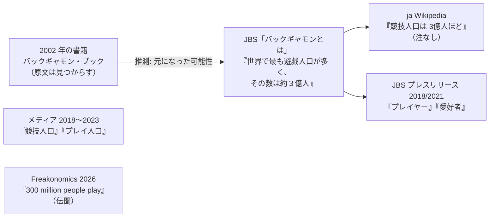

# TODO-048 調査報告（「約 3 億人」は競技人口か遊戯人口か）

調べた日: 2026-09-30。ファイルは直していない（この報告だけ書いた）。

- 「原文取得」= curl または WebFetch でページ本体を取り、本文の文字列を確認した。
- 「要約のみ」= 検索結果や WebFetch の要約で、原文の文字列を確認していない。
- WebFetch の引用は小型モデルの抜粋なので、重要なものは curl で本文を取って確かめた。

## 結論

- 協会の文言は「遊戯人口」。「競技人口」と書いた一次資料は見つからなかった。
- 前回の報告（TODO-025）の「Wikipedia の注は p206」は不正確だった（下の A-2）。
- 「3 億人」の根拠（調査方法）はどこにも書かれていない。

## A. 日本バックギャモン協会（JBS）

### A-1. 「バックギャモンとは」ページ（原文取得。ただし現行サイトには無い）

- URL: https://backgammon.or.jp/?page_id=746
- 現在（2026-09-30）は HTTP 404。curl（User-Agent 付き）でも WebFetch でも 404。
  トップページ https://backgammon.or.jp/ は 200 で、メニューに「バックギャモンを知る」の
  「バックギャモンのルール（基本編）」「ゲームに必要なアイテム」はあるが、
  「バックギャモンとは」は無い。サイト内検索（REST の search）でも「遊戯人口」「競技人口」は 0 件。
- Internet Archive の保存版は取得できた。
  http://web.archive.org/web/20250613045657id_/https://backgammon.or.jp/?page_id=746
  （保存日 2025-06-13、`<title>` は「バックギャモンとは | 日本バックギャモン協会」）。原文:

  > バックギャモンは「西洋双六」、「盤双六」等といわれるボードゲームです。
  > ボードゲームの中では世界で最も遊戯人口が多く、その数は約３億人といわれています。
  > 最近、日本ではパソコンのゲームソフトや入門ビデオが発売されるなど、
  > 新たなブームが起こりつつあります。もっと知りたい方はこちらもどうぞ
  > ■ バックギャモンのルール　■ JBL公式トーナメントルール

- 注意:
  - 表記は「遊戯人口」。「競技人口」「プレイヤー」ではない。
  - 「約３億人」は「といわれています」という伝聞。根拠、調査、年の記載はない。
  - 「JBL」（旧称）や「最近、パソコンのゲームソフトや入門ビデオが発売され」という
    書きぶりから、古い文章のまま置かれていたページ。書かれた年は不明（推測: 2000 年代）。
  - 「欧米を中心に」の記述はこのページには無い。

### A-2. JBS が別の文書で使っている言い方（原文取得。curl で本文確認）

| 文書 | 原文 | 言い方 |
|------|------|--------|
| プレスリリース 2018-08-08 https://backgammon.or.jp/?p=55071 | 「バックギャモンは世界でもっとも遊ばれているボードゲーム。世界中で3億人以上のプレイヤーがいると言われています。」 | プレイヤー（3 億人「以上」） |
| 望月プロ優勝の記事 2021-08-02 https://backgammon.or.jp/?p=64955 | 「バックギャモンは3億人の愛好者がいると言われるボードゲームですが」 | 愛好者 |
| シモキタ名人戦の記事 2021-10-16 https://backgammon.or.jp/?p=65175 | 「バックギャモンは３億人の愛好者がいると言われるボードゲームですが」 | 愛好者 |

- JBS 自身、「遊戯人口」「プレイヤー」「愛好者」と使い分けていて、どれにも
  「競技」の語は付いていない。

### A-3. ja Wikipedia の書き方（原文取得。wikitext を API で取得）

- URL: https://ja.wikipedia.org/wiki/バックギャモン（2026-07-03 版で確認）
- 原文（wikitext）:

  > 同年からは日本選手権が毎年開催されるようになった<ref>「バックギャモン・ブック」p206　日本バックギャモン協会編著　2002年10月20日初版発行</ref>。日本バックギャモン協会によれば、現在、競技人口は欧米を中心に3億人ほどが存在するという。[[日本]]の競技者は、推定20万人ほどであるが、世界ランキングの上位者を何人も輩出しており、レッスンや試合の報酬などで生計を立てるプロも存在する<ref>{{cite news |title=今から世界一も夢じゃない？　日本はバックギャモン強豪|newspaper=[[朝日新聞]] |date=2021-03-13 …}}</ref>。

- 前回報告の訂正: p206 の注が付いているのは直前の文（日本選手権が毎年開催）。
  「競技人口は…3億人」の文には注が付いていない。したがって「3 億人」の出典が
  『バックギャモン・ブック』p206 だとは、Wikipedia からは言えない。
- 「日本バックギャモン協会によれば」と書きながら、協会の言い方（遊戯人口）を
  「競技人口」に書き換えている。「欧米を中心に」の出どころも不明（A-1 の原文には無い）。

## B. 『バックギャモン・ブック』p206 の原文

- 見つからない。
- 書誌のみ確認（要約のみ）: 日本バックギャモン協会編著、河出書房新社、2002-10-19 初版
  （ISBN 9784309265971、丸善ジュンク堂の商品ページ。在庫なし）。改訂新版が 2017-04-27。
  https://www.maruzenjunkudo.co.jp/products/9784309265971
  商品ページに目次や本文はなく、「人口」「億人」の語も無い。
- 本文を引用した記事は探した範囲では無かった。原文に当たるなら、実物を図書館で見るしかない
  （p206 は Wikipedia の注の位置からすると日本選手権の記述の頁で、3 億人の頁かどうかは不明）。

## C. 英語圏の出典

1. Freakonomics Radio, Episode 677「Can Backgammon Save Us from Ourselves?」（2026-06-12）
   https://freakonomics.com/podcast/can-backgammon-save-us-from-ourselves/
   （原文取得。curl でトランスクリプトの本文を確認）
   ゲストは Frank Frigo（世界王者経験者）。司会の Dubner の問い
   「how do you think about the size of it?」への答え:

   > FRIGO: I've heard something like 300 million people play globally. In some countries where it has a long, deep history, you see backgammon or tavla or sheishbeish, however they want to call it, in particular culture, it's played everywhere. So what I see even in the United States is that there's multiple tiers. There's this social component of it. Then there's the casual tournament player. Then you have the more serious tournament player, there's a big spectrum.

   - 意味は「people play」（遊ぶ人）。伝聞（"I've heard"）で、競技者に限っていない。
     直後に「社交として遊ぶ人 → 気軽な大会参加者 → 本格的な大会参加者」の段階があると
     説明していて、3 億人は最下層（社交として遊ぶ人）を含む数として使われている。
   - 同じ回で、オンライン対戦サイト Backgammon Galaxy の共同創業者 Marc Olsen は
     「We have about 220,000 users.」と答えている（C の参考、D-3 も参照）。

2. SoraNews24（2021-03-15、Master Blaster）
   https://soranews24.com/2021/03/15/japan-emerges-as-a-backgammon-powerhouse-in-the-world/amp/
   （WebFetch の抜粋。日付と一致する引用は Japan Today 転載版でも同文）

   > There is said to be only 200,000 competitive backgammon players in Japan compared to a global total of 300 million

   - ここは「competitive backgammon players」と書き、日本の 20 万人と世界の 3 億人を
     並べている。出典は記事末尾に「Asahi Shimbun, Nikkan Sports, Japan Backgammon League」と
     まとめて挙げるだけで、この数字の出どころは特定されていない。
   - つまり 3 億人を「競技」の意味で書いた例。ただし元の朝日新聞の記事は取得できず
     （asahi.com は WebFetch 不可、curl は 404）、朝日が「競技」と書いたかは未確認。

3. WBGF・USBGF の公式サイト
   - World Backgammon Federation（Wikipedia 英語版）: 加盟 40 か国超とあるが、人数の記載なし。
   - USBGF「Our Mission」https://usbgf.org/about/our-mission/ : 「million」の記述なし。
   - 国際団体が 3 億人を公式に使っている例は見つからなかった。

## D. 「競技人口」の数字として使えそうなもの

不確かなものを含む。3 億人と同じ「世界の競技人口」を示す出典は見つからなかった。

1. 日本の競技者「推定 20 万人」
   - ja Wikipedia（A-3 の引用）。注は朝日新聞 2021-03-13「今から世界一も夢じゃない？　日本はバックギャモン強豪」
     （原文は取得できず）。4Gamer（2023-04-11、WebFetch の抜粋）:
     「世界では3億人のプレイ人口がいると言われ」「日本のプレイ人口は20万人と少ないが」
     https://www.4gamer.net/games/672/G067279/20230411043/
   - 日本の 20 万人も根拠不明で、同じ書きぶりでも媒体で「競技者」「プレイ人口」とぶれる。
2. 日本の競技人口「10 万人ほど」: J-CAST 2009-07-22
   「日本の競技人口は10万人ほどと言われ、90年代初頭ごろから毎年20名ほどが参加している。」
   https://www.j-cast.com/2009/07/22045837.html?p=2（WebFetch の抜粋）
3. オンライン対戦サイトの利用者数: Backgammon Galaxy「about 220,000 users」（上の C-1、
   Freakonomics の Olsen の発言。サービス 1 つの利用者数）。
4. 大会の参加者数（実際に数えられた数）:
   - ギネス世界記録「最大のオンライン・バックギャモン大会」21,940 人（2020-08-16、
     Backgammon Stars、トルコ）。前回報告 TODO-025 の A で確認済み（今回は再確認していない）。
   - 世界選手権（モンテカルロ）の本戦は 200〜250 人ほど、という検索結果の要約があった
     （要約のみ。原文は未確認。2016 年の第 41 回は Championship 144 人＋ Intermediate 47 人、
     というのも要約のみ）。
5. レーティング登録者数: 見つからなかった（探した範囲では、公開された総数を示す資料が無い）。

## E. メディアの言い方（参考。WebFetch の抜粋のみ）

| 媒体 | 原文 |
|------|------|
| 日刊ゲンダイ 2018-12-17 https://www.nikkan-gendai.com/articles/view/life/243876 | 「その数なんと３億人！」（数の対象は抜粋からは不明） |
| 文春オンライン 2022-05-01 https://bunshun.jp/articles/-/53532 | 「世界で3億人の競技人口を誇るボードゲーム」 |
| 4Gamer 2023-04-11 | 「世界では3億人のプレイ人口がいると言われ」 |
| goodus.jp（前回報告） | 「世界に3億人のプレイヤーがいると言われています」 |

競技人口と書く媒体もあるが、出典として挙げているのは協会（またはその言い回しの
写し）に見える（推測）。

## 見立て

- 出典に忠実なのは「遊戯人口（遊ぶ人）」。協会の原文が「遊戯人口」で、Freakonomics の
  Frigo も「people play」（社交で遊ぶ人を含む段階の説明つき）。「競技人口」は
  ja Wikipedia の書き換えと、それを写したらしい記事で、一次資料では確認できない。
- 数字そのものは、協会の伝聞「といわれています」で、調査や推計の方法が無い。
  書くなら「世界で約 3 億人が遊ぶと言われる」のように、「言われる」を残すのが忠実。
  「競技人口」と書くと、大会に出る人の数と読まれてしまい、実態（日本で推定 20 万人、
  世界選手権の本戦が 200 人台）と大きく食い違う。
- 参考: JBS 自身のプレスリリースは「プレイヤー」「愛好者」とも書いている。
  スライドで「遊戯人口」が硬ければ「遊ぶ人」「愛好者」でも協会の使い方の範囲内。

## 未確認

- 『バックギャモン・ブック』p206（および 2017 年改訂版）の原文。
- 朝日新聞 2021-03-13 の記事本文（20 万人・3 億人の書き方）。
- 「バックギャモンとは」ページの元の執筆年（Internet Archive の他の保存日の比較はしていない）。
- 世界選手権の参加人数（要約のみ）。
