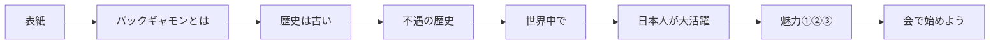

# TODO-022. スライドの並び順を見直す

|      | main | 担当 |
|------|------|------|
| 見込み | Opus 5.5 / effort medium | main（実装）+ verifier（Sonnet 5.5 / medium） |
| 実施 | Opus 5.5 / effort 不明 | main（実装）+ verifier（Sonnet 5.5 / medium） |

| 担当 | モデル | effort | input | output | cache_creation | cache_read | 割合 |
|------|--------|--------|-------|--------|----------------|------------|------|
| main | Opus 5.5 | 不明 | 462 | 159,335 | 543,383 | 68,342,618 | 75% |
| general-purpose | Sonnet 5.5 | 組み込み | 350 | 22,897 | 489,627 | 13,921,906 | 16% |
| verifier | Sonnet 5.5 | medium | 158 | 2,920 | 518,544 | 7,491,187 | 9% |
| 合計 |  |  | 970 | 185,152 | 1,551,554 | 89,755,711 | 計 91,493,387 |

- **TODO-020〜032 の 13 件の合計**（どの項目のファイルにも同じ表を載せている）。13 件を並行して
  進めたので、項目ごとには切り分けられない。`token-usage.py TODO-099 --since '2026-09-30 11:04:41'`
  で、並行作業を始めた時刻から決着の直前（17:19）までを集計した。途中で頼まれた ccspk の
  辞書の登録と ufw の設定の分も入っている
- main の effort は記録に残っていないので「不明」とした。general-purpose は Agent ツールで
  `sonnet` を指定した（定義ファイルが無いので effort は無い）。verifier は定義のまま（sonnet / medium）
- サブエージェントの分は少なめに出る（todo-workflow skill）

## きっかけ

歴史の話が途中で戻り、「日本人が大活躍」の直後に暗い話が来て、知らない人が一番知りたい
「どんなゲームで、なぜ面白いか」が後半にあった。順は main に任された。

## やったこと

推奨の案（物語の順）にした（3a35dd7、e924db1）。

- 「不遇の歴史」を「世界中で」の前へ動かした
- つなぎのナレーションを直した
  - 世界中: 「でも、世界に目を向けると、」で始め、「日本では相手が見つからない」を受ける
  - 日本人: 「その世界選手権で、日本人が大活躍しています。」（前のスライドの世界選手権を受ける）
  - とは: 「仲間」が 2 回続くので、盤双六は「同じ系統の遊び」にした
  - 会への誘い: 確認の指摘で、6 枚前の話を思い出せるよう「日本では、対戦相手を見つけるのが
    むずかしい、とお話ししました。それなら、」で始めた（e924db1）。のちに TODO-027 で
    利用者の指示により、「不遇の歴史」の引用が「世界に比べて知る人の少ないゲームに」に変わり、
    ここも「日本では、まだ知る人の少ないバックギャモンですが、」に合わせた
- 別案（魅力を「とは」の直後に置く）は採らなかった。「相手が見つからない → 世界では大勢
  → 魅力 → 会に来れば相手がいる」と、最後の誘いまで話がつながる方を選んだ

## 確かめたこと

- verifier: 並び順は指示どおり。動かしたブロックの中身は、ナレーション 3 か所・duration・
  コメントのほかは変わっていない
- ナレーションを 1〜10 まで通して読み、前のスライドと合わない所は無い
- 10 枚の duration は `ytslide measure` と一致。`ytslide check` は問題なし
- 詳細は [archives/agents/TODO-022/](../agents/TODO-022/README.md)

## 分担の振り返り

- **verifier が見つけたこと**: 会への誘いの冒頭が 6 枚離れた話を受けていて、直前とつながら
  ないこと（直した）。「最初に見た 4 つ」が通じるかは判断できないとした
- **見込みとの食い違い**: 無い。新しいスライド（TODO-020・021）が揃ってから並べ替えたので、
  やり直しは無かった
- **次に同じ規模の項目をやるなら**: 並べ替えの確認では、ナレーションを通しで読ませる
  ことを依頼に入れる（今回は入れていて、それで指摘が出た）
