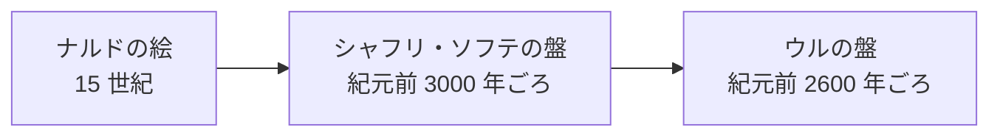

# TODO-057. 「バックギャモンの歴史は古い」の説明文字を大きくし、起源の絵を時代に合わせる

|      | main | 担当 |
|------|------|------|
| 見込み | Opus 5.5 / effort medium | main（実装）+ verifier（Sonnet 5.5 / medium） |
| 実施 | Opus 5.5 / effort medium | main（調査と実装）+ verifier（Sonnet 5.5 / medium） |

| 担当 | モデル | effort | input | output | cache_creation | cache_read | 割合 |
|------|--------|--------|-------|--------|----------------|------------|------|
| main | Opus 5.5 | medium | 160 | 23,379 | 75,859 | 6,858,706 | 89% |
| verifier | Sonnet 5.5 | medium | 58 | 1,114 | 48,064 | 772,834 | 11% |
| 合計 |  |  | 218 | 24,493 | 123,923 | 7,631,540 | 計 7,780,174 |

- 立ててから着手まで別の項目を挟んだので、`--since '2026-10-01 06:03:00'` で切った
- verifier は定義（`~/.claude/agents/verifier.md`）のまま、sonnet / medium

## きっかけ

「約 5,000 年前」の点の上に 15 世紀のナルドの絵があり、時代が合わないと利用者から指摘された（2026-10-01）。
時間軸の説明の文字も小さかった。

## やったこと

`slides/backgammon.js` の「バックギャモンの歴史は古い」を変えた。

- 絵の説明（`fig` の figcaption）を `clamp(0.6rem, 1.2cqw, 0.9rem)` から `clamp(0.75rem, 1.7cqw, 1.3rem)` に、時代の説明（`cap`）を `clamp(0.9rem, 2cqw, 1.5rem)` から `clamp(1rem, 2.6cqw, 2rem)` にした
- 大きくすると「（おおよ／そ）」のように 1 字だけ折り返したので、3 つの説明に ` ` を入れて改行の位置を決めた
- 中央の説明は、利用者の指示で「伝わった道（おおよそ）」を削り、「中東から世界へ」だけにした。説明の行数が揃わず中央の絵だけ下にずれたので、3 つの図を上端でそろえた（`items-end` を `items-start` に）
- 左の絵を、大英博物館にあるウルの王族のゲーム盤の写真 `images/bg-ur.jpg`（BabelStone、CC0。Commons の 960px のサムネイル）にした。説明は「ウルの王族の墓から出た盤（紀元前 2600 年ごろ、イラク）」
- クレジットを「写真: BabelStone（CC0）」に直し、`images/bg-nard.jpg` を消した

最初はシャフリ・ソフテ遺跡の盤（Cyrussis、CC BY-SA 4.0）を入れた。年代は「約 5,000 年前」に合うが、利用者がウルの盤の写真を候補から選び直した。
ウルの盤は約 4,500 年前で、時代の説明「約 5,000 年前の中東」とは 500 年ほどずれる。そのことは選ぶときに伝え、絵の説明に「紀元前 2600 年ごろ」と年代を書いた。

## 確かめたこと

verifier が幅 1280px と 412px で実測した（[報告](../agents/TODO-057/verifier-report.md)）。

- 左右の説明はどちらの幅でも 2 行。1 字だけの行、枠からのはみ出し、クレジットとの重なりは無い
- 3 つの絵の上端と下端がそろう。説明が 1 行の中央だけ、説明の下端が約 18px 上になるが、説明は各絵のすぐ下に付くのでそのままにした
- 写真は欠けずに映っている
- Commons の API で、ライセンス（CC0）と作者（BabelStone）がクレジットと合う
- `bg-nard`・`bg-sokhta` への参照は archives の外に残っていない

## 分担の振り返り

- verifier は、文字を大きくしたために中央の説明が 1 字だけ折り返すのと、説明を 1 行にしたために中央の絵だけ下にずれるのを見つけた。main が 1 回撮ったスクリーンショットは古い JS がキャッシュされていて、この折り返しに気づけなかった
- 見込みとの違いは、写真の調査を main がしたことと、写真を 2 回替え、説明の文言と図の並びも直したため、確認を 5 回頼んだこと。3 回とも同じ担当に続けて頼んだので、測定スクリプトは使い回せた
- 次に写真を替える項目では、候補を並べて利用者に選んでもらってから実装し、確認に回す。先に 1 枚決めて入れると、選び直した分だけ実装と確認をやり直すことになる
