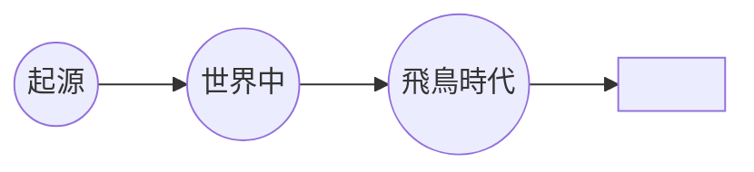

# TODO-066. 「バックギャモンの歴史は古い」の時間軸を、起源の丸から始めて丸ごとに矢印を付ける

|      | main | 担当 |
|------|------|------|
| 見込み | Opus 5.5 / effort medium | main（実装）+ verifier（Sonnet 5.5 / medium） |
| 実施 | Opus 5.5 / effort medium | main（実装）+ verifier（Sonnet 5.5 / medium） |

| 担当 | モデル | effort | input | output | cache_creation | cache_read | 割合 |
|------|--------|--------|-------|--------|----------------|------------|------|
| main | Opus 5.5 | medium | 36 | 9,042 | 20,953 | 2,603,474 | 88% |
| verifier | Sonnet 5.5 | medium | 30 | 1,176 | 31,502 | 328,025 | 12% |
| 合計 |  |  | 66 | 10,218 | 52,455 | 2,931,499 | 計 2,994,238 |

- verifier は定義（`~/.claude/agents/verifier.md`）のまま、sonnet / medium

## きっかけ

TODO-057 のあと、利用者から指示があった（2026-10-01）。丸が起源なので、その左に線は要らない。丸ごとに、その丸へ向かう矢印を付けたい。
形は `●━━▶●━━▶●━▶` に決めた（右端の矢じりを残す案を利用者が選んだ）。

## やったこと

`slides/backgammon.js` の「バックギャモンの歴史は古い」の時間軸を変えた。

- 線の左端を 1 列目の中心 `calc((100% - 3.6cqw) / 6)` にし、左端の丸みを取った
- 2 つ目・3 つ目の丸の手前に、その丸へ向かう矢じりを置いた。丸のマスの中心から `50% + 2.3cqw` 左が先端になる。色は線のその位置に合わせ、emerald-300 と lime-400 にした
- 利用者の指示で矢じりを大きくした（手前 3.6×4.4cqw、右端 4×4.8cqw）
- 右端の矢じりが下の説明に接したので、説明の行の上の余白を `1cqw` から `1.6cqw` にした

## 確かめたこと

verifier が幅 1280px と 412px で実測した（[報告](../agents/TODO-066/verifier-report.md)）。

- 線の左端は 1 つ目の丸の中心にあり、丸より左に線は無い
- 手前の矢じりは次の丸に重ならない（1280px で隙間 2.6px）。412px では、縮小前の ring の幅と縮小後の座標を比べて「重なる」と出たが、画像では接しているだけなので、重なりではないと判断した
- 右端の矢じりと下の説明の余白は 5.2px（1280px）と 2.2px（412px）。説明の下端はクレジットより上にある

## 分担の振り返り

- verifier は、矢じりを大きくしたあと右端の矢じりが下の説明に接するのを見つけた。412px の重なりの指摘は、縮小表示の値と縮小前の値を混ぜた測り方によるもので、実際の問題ではなかった
- 見込みどおりの編成だった。利用者の指示で矢じりの大きさを途中で変えたので、同じ担当に 3 回続けて測らせた
- 次に縮小表示のある画面で測らせるときは、「getBoundingClientRect の値どうしで比べ、computed style の長さは縮小率を掛けてから比べる」と依頼に書く
