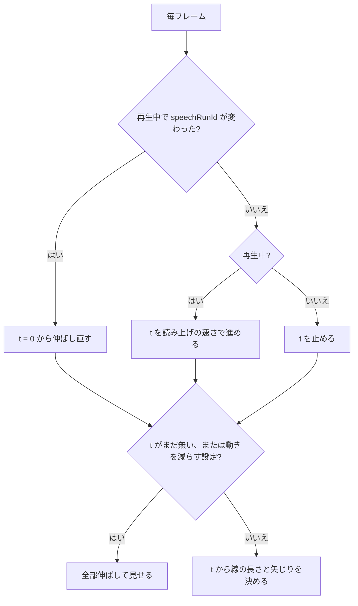

# TODO-073. 「バックギャモンの歴史は古い」の時間軸の矢印を、ナレーションに合わせて伸ばす

|      | main | 担当 |
|------|------|------|
| 見込み | Opus 5.5 / effort medium | main（実装）+ reviewer（Opus 5.5 / high）+ verifier（Sonnet 5.5 / medium） |
| 実施 | Opus 5.5 / effort medium | main（実装）+ reviewer（Opus 5.5 / high、4 回）+ verifier（Sonnet 5.5 / medium） |

| 担当 | モデル | effort | input | output | cache_creation | cache_read | 割合 |
|------|--------|--------|-------|--------|----------------|------------|------|
| main | Opus 5.5 | medium | 100 | 31,228 | 62,504 | 4,724,872 | 56% |
| reviewer | Opus 5.5 | high | 98 | 3,590 | 118,866 | 3,390,113 | 41% |
| verifier | Sonnet 5.5 | medium | 18 | 616 | 39,464 | 216,211 | 3% |
| 合計 |  |  | 216 | 35,434 | 220,834 | 8,331,196 | 計 8,587,680 |

- reviewer・verifier とも、定義（`~/.claude/agents/`）のモデルと effort のまま
- 集計の範囲には、作業の途中で立てた TODO-074〜077 のやり取りも少し入っている

## きっかけ

利用者の相談（2026-10-02）: 歴史のスライドの矢印を、ナレーションに合わせて伸びていくようにしたい。

## やったこと

`slides/backgammon.js` に `historyGrow()` を足した。`player.html` は yt_slide から揃えているので変えていない。

- 時間軸の線（`#history-line`）を `clip-path` で左から見せていく。「その後、…世界中に広がりました」で起源の点から中央の点まで、「日本にも、飛鳥時代には…」で中央の点から右端まで伸ばす。矢じりは、線の先が届いたら出す
- 伸ばし始める秒は、Online TTS の音声を文の区切りまで取って長さを測り、1.4 倍速で割って決めた（「その後」8.3 秒、「日本にも」12.5 秒、全体 17.5 秒）。立てたときは文字数の比で見積もるつもりだった
- 読み上げの位置は取れないので、読み始めてからの秒を自分で数える。`player.html` は再生開始・再開・シーク・速度変更・ミュート解除・声の切り替えでナレーションを頭から読み直すので、そのたびに増える `speechRunId` を見て、線も最初から伸ばし直す（利用者が「読み直しに合わせる」を選んだ。進行バーとはずれる）
- 進行バーの経過秒（`currentSlideElapsedTime`）は、スライドの尺で止まるので使わなかった
- 速さは、`player.html` と同じく `MAX_SPEECH_RATE` で抑える。ミュート中は、`player.html` がナレーションの代わりに尺の分だけ待つので、その待ちに合わせて伸ばす
- 再生していないうちに開いたときと、動きを減らす設定のときは、全部伸ばした形で見せる

## 確かめたこと

- reviewer（[報告](../agents/TODO-073/reviewer-report.md)）: Playwright で、再開・シーク・速度変更・ミュートの入切・声の切り替え・再試行・2.0x・待ちの最中の一時停止のそれぞれで、線が読み直しと合うことを測った
- verifier（[報告](../agents/TODO-073/verifier-report.md)）: 幅 1280px と幅 412px で、再生前は全部見え、再生すると 8.36 秒と 12.56 秒から伸び始め、16 秒で右端まで届くことを測った。動きを減らす設定と一時停止も一致。スクリーンショットを目で見て、欠けやはみ出しが無いことも確かめた

## 残ること

- 声を鳴らしたときのずれは、耳では確かめていない。Web Speech では、計算上 2 区間目が 0.6 秒ほど早く伸び始める

## 分担の振り返り

- reviewer は 4 回で 4 つの問題を見つけた。再開のあとにナレーションを頭から読み直すのに線が続きから伸びる件、経過秒が尺で止まって線が伸びきらない件、ミュート解除などで伸ばし直さない件、2.0x で先に進む件。どれも `player.html` の読み上げの作りから来ていて、verifier の測り方では見つからない種類だった。見落としとして、速さの上限は 3 回目まで報告に無かった
- verifier は食い違いを見つけなかった。reviewer が組み合わせを測り終えていたので、見え方の確認だけに絞れた（トークンは 3%）
- 見込みとの食い違い: 担当は見込みどおりだったが、reviewer が 4 回になった。最初の設計で `player.html` がいつナレーションを読み直すかを調べず、経過秒に頼ったため
- 次に `player.html` の再生の状態に合わせて動かす項目では、実装の前に、main が `speakCurrentNarration` と `stopSpeech` を呼ぶ場面を `rg` で一覧にし、仕様に書いてから作る。reviewer への最初の依頼にも、その一覧との突き合わせを入れる。そうすれば reviewer は 1〜2 回で済む
