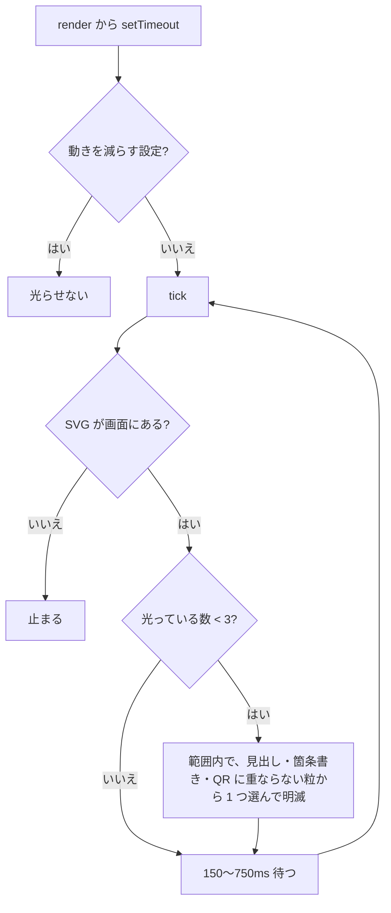

# TODO-076. 「関内バックギャモンの会で始めよう」の背景の夜景の光を、ランダムにきらめかせる

|      | main | 担当 |
|------|------|------|
| 見込み | Opus 5.5 / effort medium | main（実装）+ reviewer（Opus 5.5 / high）+ verifier（Sonnet 5.5 / medium） |
| 実施 | Opus 5.5 / effort 記録なし | main（実装）+ reviewer（Opus 5.5 / high）+ verifier（Sonnet 5.5 / medium）× 2 回 |

| 担当 | モデル | effort | input | output | cache_creation | cache_read | 割合 |
|------|--------|--------|-------|--------|----------------|------------|------|
| main | Opus 5.5 | 記録なし | 130 | 34,307 | 168,356 | 5,789,477 | 88% |
| reviewer | Opus 5.5 | high | 32 | 3,547 | 58,091 | 579,797 | 9% |
| verifier | Sonnet 5.5 | medium | 16 | 539 | 56,942 | 135,881 | 3% |
| 合計 |  |  | 178 | 38,393 | 283,389 | 6,505,155 | 計 6,827,115 |

- 立ててから着手まで TODO-073 の作業を挟んだので、`--since '2026-10-02 02:11:26'`（TODO-073 の決着の直後）で集計した
- main の effort は、途中で `/clear` を挟んで記録が残っていない
- verifier は 1 回目が報告を書く前に `/clear` で途切れ、同じ計測スクリプトで 2 回目を立てた。1 回目の分は集計に出ていない（9 メッセージは 2 回目の分）

## きっかけ

利用者の相談（2026-10-02）: 最後のスライドで、背景の夜景の光がランダムにきらめくようにできるか。
写真（`bg-karena.jpg`）は左上が窓の外の夜景（明かりの付いたビル）で、手前に人とテーブル、天井の照明もある。
光の粒は夜景の部分にだけ置き、天井の照明や、箇条書き・QR の札と重なるところには置かない。

## やったこと

`slides/backgammon.js` だけを変えた（`player.html` は変えていない）。

- 夜景の明かりの座標 90 個を画像から拾い、`KARENA_LIGHTS` に置いた。拾い方は
  [pick-lights.py](../agents/TODO-076/pick-lights.py)（暖色で明るい画素の極大を取り、夜景の範囲の多角形の中だけ残して間引く。天井の帯の反射と窓枠ぎわは外す）
- `karenaLights`: 画像と同じ `viewBox="0 0 1600 1200"` の SVG を `preserveAspectRatio="xMidYMid slice"` で敷く。`object-cover`（中央）と同じ切り方になるので、幅を変えても明かりからずれない。粒は放射グラデーションの円と十字の光
- `karenaTwinkle()`: 150〜750ms ごとに、光っていない粒から 1 つを選び、拡大・回転しながら明滅させる。同時に光るのは 3 個まで。表示範囲の外の粒と、見出しの文字（Range で文字の範囲を取る）・箇条書き・QR の札に重なる粒は、光らせるたびに外す
- 動きを減らす設定では光らせない。他のスライドへ移ると `svg.isConnected` で止まる（`rulesBattle` / `historyGrow` と同じ作り）
- `bgSlide` に、背景の上・中身の下に重ねる `overlay` を足した

reviewer の指摘で 2 点直した。クレジットを外すために `bgSlide` に足していた `data-credit` は、重なる粒が 0 件だったので外した。見出しは `h2` の箱が横幅いっぱいで、文字の右の粒まで外れていたので、文字の範囲で見るようにした。

## 確かめたこと

verifier が Playwright で測った（[verifier-report.md](../agents/TODO-076/verifier-report.md)、計測は [verifier-measure.js](../agents/TODO-076/verifier-measure.js)）。

- 粒の位置と、`object-cover` で切られた画像上の明かりの位置の差は最大 0.00007px（幅 1280px・1920px・412px）
- 6 秒間で、同時に光る数は最大 3。見出しの文字・箇条書き・QR の札・表示範囲の外と重なった粒は 0
- 動きを減らす設定では、光る粒は 0
- 表紙へ移ると止まり、戻っても二重に走らない。他のスライドに光の SVG は出ない
- コンソールのエラーは 0

verifier が判断を保留した 2 点は main が見た。全点灯の絵で人の影に近く見えた右上の粒は、元の画像に拾った点を描いて見ると、どれも窓の内側のビルの明かりに乗っていた。幅 412px で粒が見分けられないのは、スライドが小さく粒も小さいためで、光っている粒は 3 個あった。

## 分担の振り返り

- reviewer は、`data-credit` が実際には効いていないこと（外れる粒 0 件）と、見出しの箱が横幅いっぱいで余計に粒を外していることを、実測で見つけた。どちらも直した
- verifier は、位置・同時に光る数・重なり・止め方をすべて実測で確かめた。スクリーンショットからは右上の粒が人に乗っているか判断できず、main が元の画像で確かめた
- 見込みとの食い違いは、verifier を 2 回立てたことだけ。1 回目が `/clear` で途切れたためで、計測スクリプトが残っていたので 2 回目は 9 メッセージで済んだ
- 次に同じ規模（1 ファイル内で分岐とアニメーションを足す）をやるなら、同じ編成でよい。画像の上の位置を確かめる項目では、verifier に元の画像へ点を描いた絵も見せるよう依頼に書く（スクリーンショットだけでは、粒が何に乗っているか判断できない）
