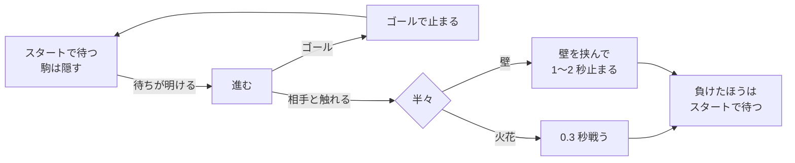

# TODO-096. 「バックギャモンとは」の矢印を 3 トラックにして、それぞれランダムに動かす

|      | main | 担当 |
|------|------|------|
| 見込み | Opus 5.5 / effort medium | main（実装）+ reviewer（Opus 5.5 / high）+ verifier（Sonnet 5.5 / medium、Playwright で実測） |
| 実施 | Opus 5.5 / effort medium | main（実装・動画の書き出し）+ reviewer（Opus 5.5 / high、6 回）+ verifier（Sonnet 5.5 / medium、途中で 2 回止めて 3 回目で完了） |

| 担当 | モデル | effort | input | output | cache_creation | cache_read | 割合 |
|------|--------|--------|-------|--------|----------------|------------|------|
| main | Opus 5.5 | medium | 228 | 45,038 | 96,045 | 12,799,543 | 76% |
| reviewer | Opus 5.5 | high | 102 | 3,701 | 250,659 | 3,614,645 | 23% |
| verifier | Sonnet 5.5 | medium | 28 | 554 | 87,004 | 238,744 | 2% |
| 合計 |  |  | 358 | 49,293 | 433,708 | 16,652,932 | 計 17,136,291 |

- reviewer と verifier は定義（`~/.claude/agents/`）のモデルと effort のまま
- 終点のコミット前に集計したので、決着のコミットまでのやり取りは入っていない

## きっかけ

「バックギャモンとは」の盤では、U 字 1 本の上で白と茶色が同じ速さで向かい合って進んでいた（TODO-072）。
利用者から、矢印を 3 トラックにして、それぞれランダムに動かしたいと頼まれた。

利用者と決めたこと:

- U 字は入れ子に 3 本並べる（1 本の上に 3 組を走らせる形ではない）
- ランダムにするのは速さと出る時刻の両方

着手してから、利用者の指示で次を足した。

- ぶつかったら、半々で、今までどおり火花で戦うか、1〜2 秒にらみ合って止まる（どちらも負けたほうが出直す）
- 止まっている間は、間に壁を出す。白い壁は見えにくい・形が分かりにくいと言われ、赤レンガの形にした
- 速さを 3 割ほど落とす
- 線の先を、矢じりの代わりに駒の絵にする
- 一番内側の U 字をやめ、外側に 1 本足す

## やったこと

`slides/backgammon.js` だけを変えた。

- U 字は `rulesTrack(k)` で作る。`k = -1, 0, 1`（間隔 60）。`k = 0` が元の U 字
- 出るたびに `launch()` で、速さ（1 秒に 0.14〜0.35）と、出るまでの待ち（0〜1.5 秒）を決め直す
- スタートで待っている間は駒を隠し、戦いの相手にしない。相手が自分のスタート（相手のゴール）で止まっている間は、待ちを進めない（重なって出ないように）
- 遅い端末で 1 フレームに触れる距離より多く進んでも、前のフレームで向かい合っていれば戦わせる（すれ違い防止）
- にらみ合いでは、駒の縁が壁に付く位置まで引き離し、赤レンガの壁（幅 36・高さ 48、3 段）を立てる
- 線の先は、白い駒・茶色の駒の円（縁は線の色）

動画は `~/Videos/slide_backgammon/framestep/` に書き出し直した。入っている `ytslide`（uv tool）は静止画 1 枚で撮る古い版で、動きが映らなかった。`~/work/yt_slide` のソースの版を `uv run --project ~/work/yt_slide --extra video ytslide video --slides backgammon --out …` で使った。

## 確かめたこと

- reviewer: 6 回（初回と、仕様を足すたびの再レビュー 1〜5）。シミュレーション（60fps・20fps、1 本あたり 600 秒）で、戦わずにすれ違うのは 0 回、にらみ合いの間の重なりは 0〜2 回（0〜1 に収めたときだけ）。詳細は [reviewer-report.md](../agents/TODO-096/reviewer-report.md)
- verifier: Playwright で 1280x720 で実測した。3 本が重ならない、6 つの駒の速さと出る時刻が揃わない、火花と壁の両方が 3 本とも出る、壁の間は駒が止まる（15 回とも 1.0〜2.0 秒）、reduced-motion で 6 つとも見えて止まる、pageerror 0 件。詳細は [verifier-report.md](../agents/TODO-096/verifier-report.md)
- 壁の見た目は、実寸の見本を拡大して撮り、利用者に見てもらった
- 書き出した動画から 2 枚目のスライドのコマを抜き、線・駒・壁が映っていることを見た

## 残ること

- 入っている `ytslide`（uv tool）が古い版のまま。次に動画を作るときも、ソースの版を使うか、入れ直す必要がある
- reviewer の好みの範囲として残したもの: にらみ合いが始まるときに駒が後ろへ跳ぶ（最大 40px ほど）、ゴールで止まると同時に待ちが明けると、まれに 1 フレームだけ重なる

## 分担の振り返り

- **reviewer** は、スタートで待つ相手との戦い、低い fps でのすれ違い、ゴールでの重なり、にらみ合いでの重なり、壁と隣の U 字のすき間を、シミュレーションの数値付きで見つけた。どれも実装に効いた
- **verifier** は、仕様が足されるたびに古い差分を測ることになり、2 回止めた。3 回目は全項目を数値で確かめたが、壁が画面では約 12x16px で、レンガに見えるかを目で判断できなかった
- **見込みとの食い違い**は、利用者の指示で仕様が 5 回足されたこと。reviewer を同じ担当に続けて頼んだので、立て直しは無かった
- **次に同じ規模なら**、見た目を利用者と詰めている間は verifier を起こさず、指示が固まってから 1 回だけ頼む。小さく映る要素の見た目を verifier に頼むときは、要素を拡大して撮るよう依頼に書く
